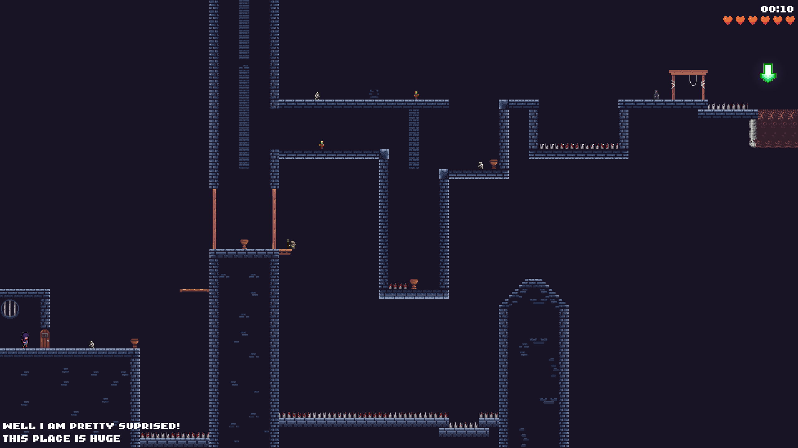

# Shadow Runner

In Shadow Runner, you must keep moving forward to survive! Hostile entities constantly spawn, each
dealing different amounts of damage, and one even has the ability to blind you, limiting your vision to a
small radius for 15 seconds. With every challenge, the only way to succeed is to push ahead, adapt, and
endure.

## Development

This game was developed for [Code for a Cause](https://itch.io/jam/code-for-a-cause) during the weekend.
Go ahead and try the game at [as1100k.itch.io](https://as1100k.itch.io/shadow-runner).

This project is also a great example for building 2d games with [bevy](https://bevyengine.org/) and
[ldtk](https://ldtk.io/)

Run `./run.sh` for more info

### Stuff Implemented

- [x] Basic Bevy Template
- [ ] Game Screens
  - [x] Start Screen/Main menu
  - [x] Game Pause
  - [x] Game Over
  - [x] Level Selector/Level Menu
  - [x] Loading Screen _BUG: Not Rendering_
  - [ ] Settings Screen
  - [x] Credit Screen
- [x] Level Design (Parkour, etc.)
- [x] Display Best Time of Each level
- [ ] MultiPlayer
- [x] Player
- [x] Hostile Entities
- [x] Characters & Theme
- [x] Animations
- [x] Music

## Contributing

I will not be accepting any PR(s) that introduces new levels, abilities, and any form of game design, but
bug fixes and dependency update PR(s) will be listened and merged.

For more information about this project, please read [CONTRIBUTING.md](./CONTRIBUTING.md)

## Credits

Refer to [credits.md](./credits.md)

## License

The game code is licensed under the [MIT License](./LICENSE-MIT). The assets used in this project are licensed
as specified in the [credits.md](./credits.md) file. If a license is not provided for an asset,
it defaults to the [APACHE License](./LICENSE-APACHE). Additionally, the `shadow_runner.ldtk` file is licensed
under the [APACHE License](./LICENSE-APACHE).
